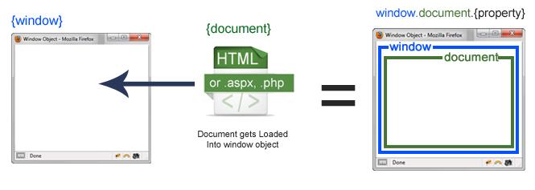

# DOM Intro

## Learning Objectives
- Understand what the DOM is and what it isn't
- Know why the DOM exists
- Understand what the window object is
- Understand what the document object is

### Duration
1 hours

### Intro

Now that we live in BrowserLand we need to start taking other things into consideration if we want to start interacting with our page.

At the moment, we are fine, since the console.log message isn't actually interacting with anything. Express comes along, loads the script, the message is logged and it moves on. Which is fine, but life won't always be so simple. We want to be handling button clicks, changing CSS classes, adding Nyan cat gifs... and life gets a little more complicated. Let's see this in action.

### So What's the DOM?

When the browser accesses an HTML page, it downloads it, parses it, and then uses it to construct the DOM.

DOM stands for ***Document Object Model***. 

It is a representation of the HTML document created in the memory of the browser. Without it, we could only write server rendered apps like we did in Sinatra. Remember how we always had to reload the page on buttons clicks and to retrieve updates from the server? Well, no more!!! JS and the DOM to the rescue.

JavaScript can interact with and modify the DOM, which in turn alters what the user sees in the browser. That's how we produce interactive websites.

Now the DOM inscludes a lot of things, the elements on the page AND information about the enviroment itself - the browser.

> Draw DOM


The "window" object is our environment and our "document" object is the DOM representation of our HTML.

### HTML vs DOM
Is the HTML we write in our .html documents the same as the DOM?

No. But it is used by the browser to ***construct*** the DOM.

### The Document Object

Cool, so we can use the document object to get at the elements in the page. We do this by using any of the methods on this object. We're going to look at these in more depth in the next lesson, but for now we'll use our very first one - getElementById.

If you have a look in index.html we have a p tag with the id "intro". We can use JS to get this and fiddle with it!

```js
//console in browser
var tag = document.getElementById('intro');
tag.innerHTML = "Hackzzors!"
```

Wooooah! The text dynamically updated. Note: if we reload the page, the text is back to normal. It _does not change the file_ it _changes the DOM_. Remember how they are different? The DOM was initially constructed from our HTML, then the _state of the DOM_ was modified by our JS here. The file has not changed, so when the page reloads and the DOM is repopulated, _the state change we made is lost_.

Alright, so let's move this code to our script and get cooking with gas.

```js
//app.js
var tag = document.getElementById('intro');
tag.innerHTML = "Hackzzors!"
```

Uh... nothing. 

[Task:] Ask the students to go open the console window and find the error.

Any ideas what has happened here? We have tried to access an element _before the DOM has loaded_. This is a disaster!

When we were just console logging it didn't matter, it wasn't _dependent on the DOM_. However, access our elements on the page is _dependent on the DOM being loaded_. This is a problem. Whatever shall we do?

### The window object

The key point here is that in order to have interactivity, we need to talk to the DOM. And to talk to the DOM it has to be loaded. So we need some way of checking that this event has happened, and then we can continue on with what we want to do.

Can you remember earlier I mentioned that we have _another_ object from the DOM we can use, that represents the Browser and effectively the enviroment we are in? Yes! The window object!

We will often want to run bits of code in response to events and we are about to encounter our very first, and most important, event.

### window.onload

Let's go to the console and look at this window object. It's enormous.

```js
//console
window
```

You can see he has loads of properties and methods, including good old setTimeout that we saw last week. Luckily, we don't need to use window.setTimeout we can just use setTimeout directly but it's good to know where these things live.

If we scroll down, we'll see a whole bunch of properties that start with "on" and are all null. These are _events we can hook into_! Have a look and see if you can see on called ***onload*** 

When do you think the onload function gets called? The clue is in the name ;) Yep, when the DOM is loaded. Just what we needed! But why is it null?

Window sits there listening for the onload event (waiting until the DOM is loaded) to be triggered and looks for a function to run when the event occurs. It's an _event listener_. 

Can you remember what we can use to pass a function to another function for it to use when it wants to?

Maybe we can assign it a behaviour to execute when it hears the event. 
Maybe we can assign it ..... a callback? Wooooah! This is too much.

Callbacks are _super important_ in BrowserLand. We don't always want our code to shoot off immediately, we often want to define a function and pass it to something else to use when an event happens. Like the window loading, or a button being clicked.

This is going to look a little odd but it's really no different to what you were doing last week.

```js
//app.js
window.onload = function() {
  var tag = document.getElementById('intro');
  tag.innerHTML = "Hackzzors!"
};
```

Sweet! It's now working.

Key point: it's important that we wait until the DOM has been loaded by the browser before we start trying to manipulate it from out JS program.

## Timing

Just to be clear,let's add a couple of console logs to our script.

```js
//app.js

console.log("first log");
window.onload = function() {
  var tag = document.getElementById('intro');
  tag.innerHTML = "Hackzzors!";
  console.log("second log");
};

console.log("third log");
```

What order will these logs be in? Woah, first, third, second, what?

Remember that the window.onload is a _callback_ and doesn't execute immediately. We pass the code to the window.onload function then our script keeps executing. When the onload event occurs, then our code is executed. Which happens to be after the rest of the script has finished.

# Nearly there

Cool, so we've got our code talking to the DOM. However, you might be thinking "Eeek! Do we need to write our code as one big block???". Well, don't worry we have some ways we can deal with this.

What do we call the kind of function we just created? It's an _anonymous function_. We can change this to be a named function, just like we used in last week.

Let's convert our callback to call another named function.

Solution:

```js
//app.js
var app = function(){
  var tag = document.getElementById('intro');
  tag.innerHTML = "Hackzzors!"
}

window.onload = app

```

What would happen if we put bracket's after app like this? 

Solution:

```js
//app.js
var app = function(){
  var tag = document.getElementById('intro');
  tag.innerHTML = "Hackzzors!"
}

window.onload = app();

```

The code is executed immediately and we are back in the same issue we had before! Be careful _not to invoke functions_. This is the beauty of callbacks - we can pass our objects to things without them running and have them call when they are needed.
