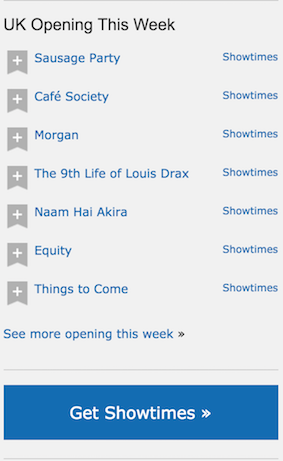

# React IMDB Homework

## Reading

Thinking In React (30 mins) https://facebook.github.io/react/docs/thinking-in-react.html

## Practice

Here's a component from IMDB showing opening movies this week. 

- Draw out the skeleton of this app on paper.
- Write down the names of the components and whether they have state or props.

For example: 
- CommentBox - State:comments
  - CommentList Props:comments
    - Comment Props:comment
    - Comment Props:comment
    - Comment Props:comment
  - CommentForm State:author, text Props:handleCommentSubmit(function) 

Once you've sketched this out, implement the IMDB component in React.

